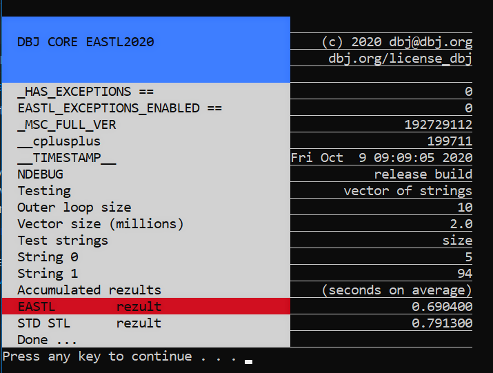

> 2021 FEB note: the use of EASTL has been generally deprecated. 
>
> That is because MS STL can be built and used in a so called "kernel" mode. 
> Meaning no C++ exceptions, and no RTTI
> "kernel" mode does not require using the cl.exe `/kernel` switch. 
> `CPP_UNWIND` is sldo undefined if cl.exe switch `/DNO_EXCEPTIONS=1` is used
> [RTTI](https://docs.microsoft.com/en-us/cpp/build/reference/gr-enable-run-time-type-information?view=msvc-160) is switched off by using `/GR-` cl.exe switch

---
Sep/Oct 2020


## Now what is this? Yet another EASTL, not-a-fork?

Well first of all these days it is [not possible](https://github.com/electronicarts/EASTL/issues/302) just to simply git pull the EASTL. So I had to download the source using vcpkg. Then I did some local shenanigans, some copies, builds and runs; and then pushed the result to this repository.

Ok, so why this? In all of my innocence I had grand plans for EASTL use over "here". Alas. Soon, I have faced the reality. By 2020 EASTL has become big and over engineered. Not to my liking at all. Thus.

### The plan and the results

- completely change the allocator design
  - **that is done**
- remove the EASTL specific containers
  - we have funny thoughts about the fixed_ bunch
      - fixed_ is ok for small-ish sizes having standard interface
      - but for that we use native arrays, also because of the kind of the projects
      - but also because we do seriously like using C11 + VLA declarations
      ```cpp
      typedef point3d(*pointer_to_matrix)[3][3];
      pointer_to_matrix pm_ = (pointer_to_matrix)
      malloc( sizeof(point3d[3][3]) );
      ```
      If confused [please read about it here](https://gustedt.wordpress.com/2014/09/08/dont-use-fake-matrices/).
  - Beside these C shenanigans, honestly we do not need containers that much after all, beside string and vector of course
      - Also we are very careful to minimize the C++ string usage

What is left in, is [good and functional](https://github.com/dbj-data/bench). Understand this: EASTL team certainly knows how to C++. I promise we will always try and inform EASTL guys if we have any relevant questions or puzzles to solve. Or if we think we can contribute to the mother ship in any way.

So it seems, I have a lot of free time? I wish. We "here" are building WIN SVR components. We use Visual Studio 2019, and each project has, among other limitations, no exceptions, no RTTI, and such. How will this repo fit in there we shall see. Soon.

So is this repo now Windows only? I hope not. But I have no Linux machine readily available. Whoever tests this on Linux or Mac please do let me know. We will cook the CIRCLE CI setup after that.

Same is for VS Code build. If you think you can contribute your .vscode folder please come forward.

This is time consuming and ambitious plan. Stay tuned :wink:

## Some ad-hoc explanations

- In the source, seek the `dbj` namespace for news and changes.
- test folder contains Visual Studio solution. Start snooping from there
- `dbj_allocator.cpp` and `<EASTL/allocator.h>` are the files with most of the new stuff
- `test/infrastructure` contains `dbj_common.h`, this is where "everything" is included for testing which is in `testing_sampling.cpp`.

## Performance sampling: EASTL vs MS STL

- We use ubench.h in [this testing repo here](https://github.com/dbj-data/bench).
- when we test, c++ exceptions are always off
     - MS STL replaces them with [SEH](https://docs.microsoft.com/en-us/cpp/cpp/structured-exception-handling-c-cpp?view=vs-2019)
     - EASTL does its own assert, which results in `__debugbreak()`
- RTTI we keep always off, too
- Road Map : in case of Structured Exception raised and caught, minidump is generated, and finally user is informed on its full path.
- 32 bit builds we ignore, as ever
- Hint: in debug builds MS STL is indeed rather slow, but in release builds it is not


Enjoy

Sep/Oct  2020
[DBJ](https://dbj.org/)
