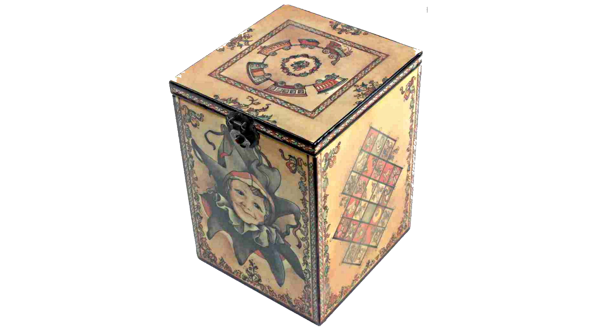

# W.I.P.

## Back to the Common

- This is where "machine wide" includes are.

- Opposite to the "single header" philosophy.

- "common headers" philosopohy

- The common "stuff" is not repeated all arround in all the "single headers"

### Cluster of projects

Git sub-modules are used 

1. the users/customers clone/pull all the common stuff they need in one go 
   1. from one place on their machines or one server
2. developers have a single place to manage

### The Management

- The development also happens here and that menas a lot of cruft. Potentially.

- Be carefull not to develop in the master branch
- Be carefull to use the master branch when including

# What is WIL doing here?

WIL is a treasure trove of using all sorts of realy important WIndows API's. In some pleaces it is using reallu low level legacy stuf (MS RPC),
or complex stuff (COM). But things will be definitely and regularly "nicked" from WIL and transformed to some dbj win32 internals.